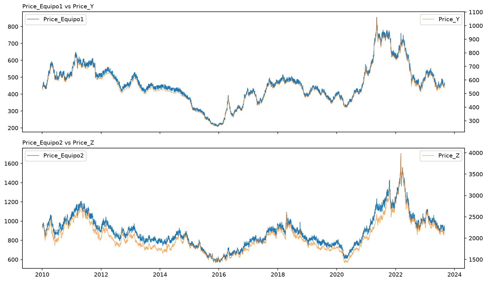
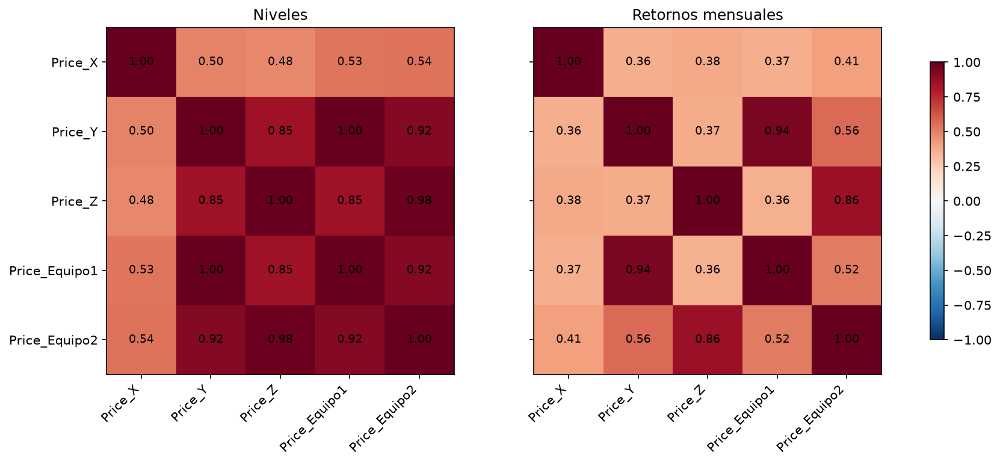
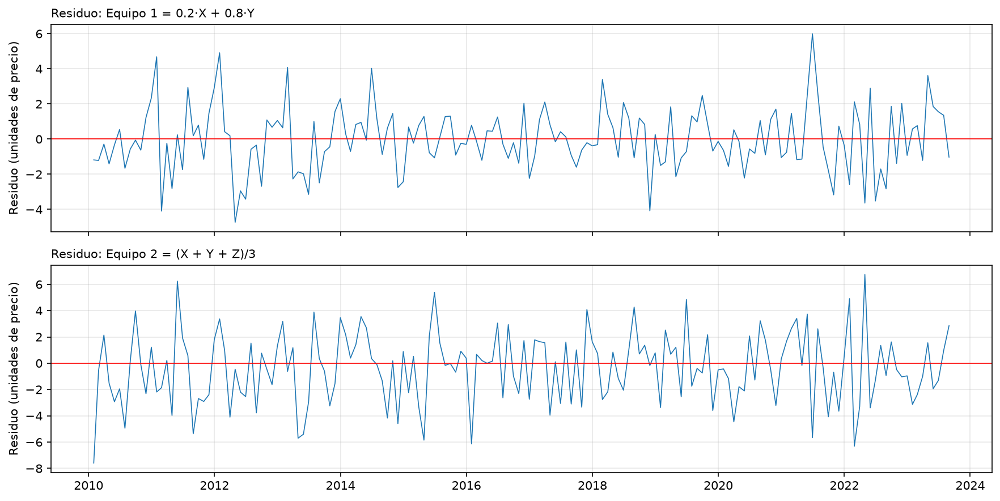
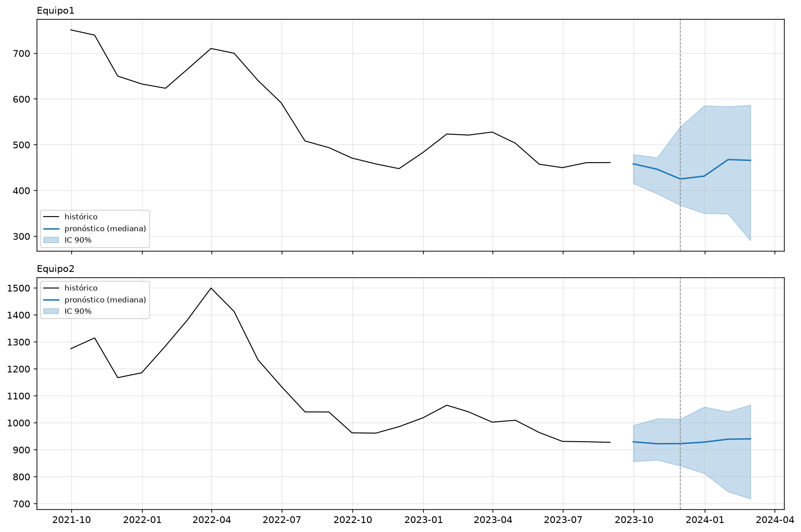
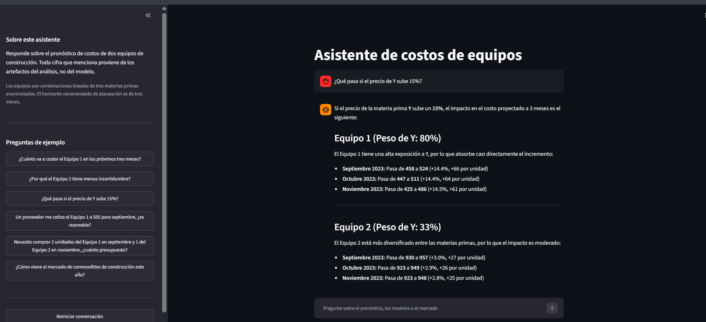
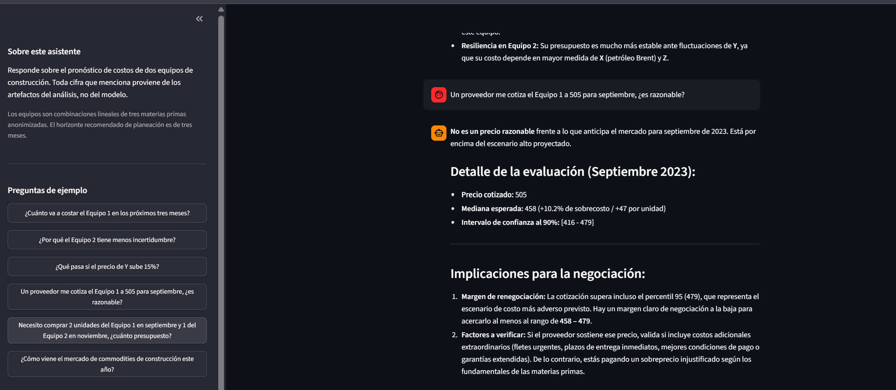
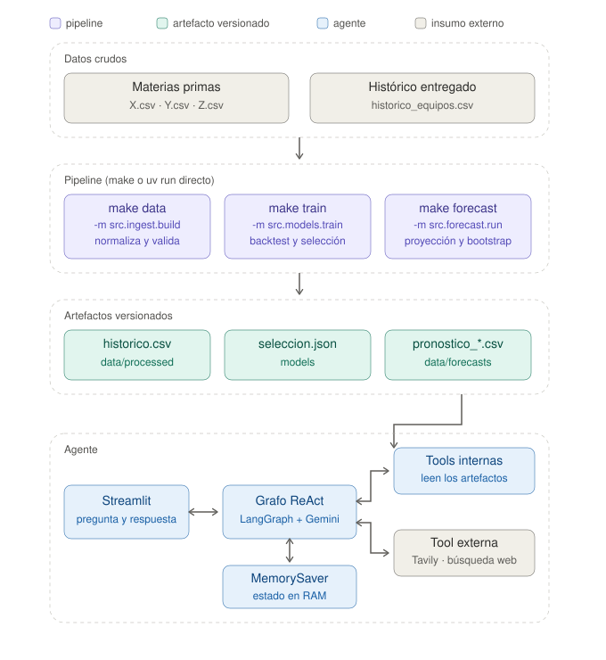
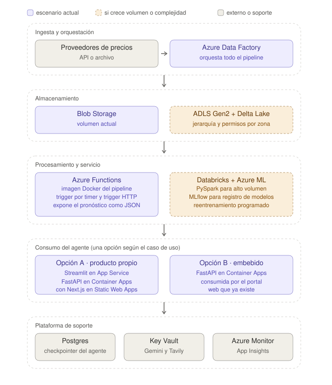

# Gestión de costos operativos en un proyecto de construcción

**Informe técnico**  ·  Alejandro Moscoso Deossa  ·  Septiembre de 2026

## Explicación del caso

Una empresa constructora planifica un proyecto con una ventana de ejecución
definida y necesita abastecerse de dos tipos de equipos críticos. El costo de
adquisición de esos equipos ha variado de forma que la empresa no logra
anticipar, y eso viene produciendo desviaciones presupuestales recurrentes.

La gerencia sospecha que esos precios se mueven con el mercado de materias
primas, pero no tiene un modelo que lo respalde ni sabe qué insumo pesa en cada
equipo. El encargo tiene tres partes: identificar qué variables explican el
comportamiento observado y cuáles son ruido, proyectar el costo hacia adelante
con un horizonte justificado y con la incertidumbre explícita, y dejar el
resultado consultable a través de un agente conversacional.

Los datos entregados son cuatro archivos: tres series diarias de precios de
materias primas anonimizadas como X, Y y Z, y un histórico que combina esas tres
series con el precio de adquisición de los dos equipos. El período común va de
enero de 2010 a agosto de 2023, con 3.530 registros diarios.

Detrás del encargo analítico hay tres beneficios de negocio declarados: un
mecanismo reproducible para anticipar costos antes de cada fase, menos
desviación presupuestal frente a la volatilidad de insumos, y una base para
evaluar proveedores de forma objetiva. La solución entregada responde a los tres.

## Supuestos

**Sobre los datos**

El histórico entregado corresponde a la intersección de fechas en que las tres
materias primas cotizan. Al reconstruirlo desde los archivos crudos, las tres
series coinciden al 100% en 3.530 registros, lo que confirma tanto el criterio de
unión como el pipeline de ingesta.

Las series se agregan a frecuencia mensual usando el precio promedio del mes. El
promedio representa mejor el costo efectivo de adquisición para planeación
presupuestal que el cierre de un día puntual, que quedaría expuesto al ruido de
esa jornada.

Los archivos crudos tienen formatos distintos que se documentan y corrigen en la
ingesta: X viene en orden descendente y con historia desde 1988, Y usa punto y
coma como separador, coma decimal, fecha en formato día/mes/año y marca BOM al
inicio, y Z trae las columnas invertidas. Ninguna de esas particularidades altera
los valores. Todas afectan la lectura.

El análisis parte de enero de 2010 porque es cuando arranca Z, y los dos equipos
requieren las tres series simultáneamente.

**Sobre el problema**

El costo de adquisición se modela exclusivamente en función del precio de los
insumos. Cualquier otro determinante (condiciones comerciales, volumen, tipo de
cambio, márgenes del proveedor) queda fuera del alcance por no estar en los datos.

Las materias primas se entregan anonimizadas. Se verificó la identidad de cada
una contra referencias públicas de mercado, con resultado concluyente solo para
X (ver Resultados). El análisis no depende de esa identificación: las
composiciones y el pronóstico se construyen igual con las series anónimas.

No hay información de proveedores, por lo que la comparación entre ellos se
resuelve como un mecanismo que contrasta una cotización contra el rango
proyectado, no como un ranking construido a partir de datos históricos.

## Formas para resolver el caso y la opción tomada en esta prueba

**Identificación de la relación insumo-equipo**

La primera decisión fue cómo establecer qué materia prima explica cada equipo.
Se consideraron tres caminos:

*Correlación bivariada.* Rápido y legible, pero mide relaciones de a pares y no
detecta el aporte de una variable condicionado a las demás. Se usó como
exploración inicial, no como conclusión.

*Regresión en niveles sin verificación previa.* Es el camino directo, y también
el más riesgoso. Series de precios con raíz unitaria producen regresiones
espurias: dos paseos aleatorios sin relación alguna arrojan R² alto y
coeficientes significativos con alta frecuencia (Granger y Newbold, 1974). Se
descartó como punto de partida.

*Verificación de estacionariedad y cointegración antes de regresar.* Es el camino
tomado. El test ADF establece si hay raíz unitaria, y el test de cointegración de
Engle-Granger determina si, a pesar de ello, existe una relación de largo plazo
que permite modelar en niveles. Solo con esa habilitación se estimó la regresión
múltiple.

**Modelado del pronóstico**

Verificada la relación, el segundo problema es proyectar. Las alternativas:

*Modelar directamente el precio del equipo* como una serie de tiempo
independiente. Descartado porque ignora la información de los insumos, que es
justamente la hipótesis del caso.

*Modelar el equipo con el insumo como variable exógena* (SARIMAX). Era el plan
inicial, y quedó sin objeto al descubrir que la relación es determinística.

*Proyectar cada materia prima y aplicar la composición.* Es el camino tomado.
Toda la incertidumbre queda concentrada en el pronóstico de los insumos, que es
donde realmente está.

**Selección del modelo de pronóstico**

Se compararon siete candidatos por serie: naive, random walk con drift,
ARIMA(1,1,1), SARIMA(1,1,1)(1,0,1,12), suavizamiento exponencial, Prophet y
LightGBM con rezagos y predicción recursiva. La evaluación usa backtest
multi-ventana (walk-forward) sobre nueve cortes anuales entre 2014 y 2022, con
horizontes de 3, 6 y 12 meses.

Se reportan tres métricas. MAPE por su lectura directa en términos de negocio.
RMSE porque penaliza los errores grandes, que son los que rompen un presupuesto.
Y MASE (Hyndman y Koehler, 2006), que escala el error contra el del método
ingenuo en entrenamiento: valores menores a 1 indican que el modelo supera al
benchmark, y la escala común permite comparar series de magnitudes muy distintas,
como X en torno a 85 y Z en torno a 2.160.

Se descartó R² porque mide ajuste dentro de muestra y su benchmark implícito, la
media del período de prueba, no tiene sentido en pronóstico de series de tiempo.

El criterio de selección exige dos condiciones: que el modelo lidere al menos dos
de las tres métricas, y que mejore el MASE del naive en al menos 5%. Si ninguno
cumple ambas, se conserva el naive. La regla es deliberada: cuando las
diferencias entre modelos están dentro del ruido, la complejidad adicional no se
justifica. La selección se ejecuta en `make train` y queda registrada en
`models/seleccion.json` con sus métricas y su fecha, de modo que el pronóstico no
depende de valores escritos a mano.

**Construcción de los intervalos**

Se optó por bootstrap de los errores del backtest en lugar de los intervalos
analíticos de cada modelo. La razón es práctica: naive y LightGBM no proveen
intervalos, y usar métodos distintos por serie haría incomparables los
resultados. El bootstrap aplica el mismo procedimiento a todos, sin supuestos
sobre la distribución del error.

## Resultados del análisis de los datos y los modelos

### Exploración

Las series de los equipos siguen de cerca a una materia prima cada una.

En retornos mensuales, el Equipo 1 correlaciona 0.94 con Y y el Equipo 2
correlaciona 0.86 con Z. X no supera 0.41 con ninguno. La correlación entre el
Equipo 2 e Y cae de 0.92 en niveles a 0.56 en retornos, lo que indica tendencia
compartida antes que relación directa.

La comparación entre ambas matrices es en sí un resultado: en niveles casi todo
correlaciona con todo, porque las series comparten tendencia. En retornos se ve
qué se mueve junto de verdad.

El test ADF confirma raíz unitaria en niveles para X (p = 0.296), Z (p = 0.217) y
el Equipo 1 (p = 0.228). Y y el Equipo 2 rechazan al 5% pero no al 1% (p = 0.026
y 0.020), evidencia límite que se reporta como tal. Todos los retornos son
estacionarios, con p máximo de 0.002.

Los tests de cointegración de Engle-Granger dan significativos únicamente para
los pares Equipo 1 con Y (p = 0.013) y Equipo 2 con Z (p = 0.010). El par Equipo 1
con Z da p = 0.047, marginal y explicable por la correlación entre Y y Z.

La correlación cruzada con rezagos muestra que la relación es contemporánea: el
rezago 0 domina en ambos equipos, con un eco menor en el rezago 1 del Equipo 1.

### El hallazgo central

La regresión múltiple sobre las tres materias primas revela que los precios de
los equipos no guardan una relación estadística aproximada con los insumos, sino
que son combinaciones lineales exactas:

| Equipo | X | Y | Z | Intercepto | Composición |
|---|---|---|---|---|---|
| Equipo 1 | 0.1983 | 0.8006 | −0.0001 (p = 0.88) | 0.04 (p = 0.97) | **0.2·X + 0.8·Y** |
| Equipo 2 | 0.3353 | 0.3353 | 0.3322 | 0.64 (p = 0.60) | **(X + Y + Z) / 3** |

Los intervalos de confianza al 95% contienen 0.20, 0.80 y un tercio
respectivamente, y los interceptos no son significativos, lo que descarta un
término independiente. Al aplicar las composiciones, el error porcentual medio es
de 0.30% para el Equipo 1 y 0.25% para el Equipo 2, con residuos centrados en
cero y sin estructura temporal.

Este resultado tiene una implicación metodológica directa: no hace falta estimar
un modelo predictivo de la relación insumo-equipo, porque la relación es
determinística. El problema se reduce a proyectar X, Y y Z.

**Sobre el proceso.** El análisis bivariado identificaba correctamente el insumo
dominante de cada equipo, pero concluía que X era ruido. La regresión múltiple
mostró que X participa en ambos con peso significativo. La correlación simple no
detecta el aporte condicionado de una variable en presencia de las demás: la
volatilidad propia de X la hace parecer ruido cuando se mide de a pares. Se deja
constancia del cambio de conclusión porque el recorrido es parte del resultado.

### Identificación de las materias primas

Las series se entregan anonimizadas, pero sus perfiles son característicos: X
presenta la caída de 2014, el desplome de 2020 y el repunte de 2022 típicos de un
commodity energético, y su rango de 20 a 128 es compatible con precios de crudo
por barril. La hipótesis se verificó correlacionando las tres series contra
referencias públicas de mercado.

| Referencia | X (retornos) | Y (retornos) | Z (retornos) |
|---|---|---|---|
| Brent | **1.00** | 0.31 | 0.45 |
| WTI | 0.89 | 0.25 | 0.36 |
| Cobre | 0.47 | 0.53 | 0.65 |
| Acero | 0.62 | 0.58 | 0.54 |
| Oro | 0.03 | 0.12 | 0.21 |

X corresponde al petróleo Brent, con correlación de 1.00 tanto en niveles como en
retornos: no es una serie parecida, es la misma. Y y Z no admiten identificación
concluyente. Sus correlaciones más altas apuntan a metales industriales, pero
ninguna alcanza para afirmarlo.

La consecuencia práctica es directa. X pesa 20% en el Equipo 1 y 33% en el Equipo
2, de modo que el mercado de crudo afecta el costo de ambos, y el agente puede
cruzar el pronóstico con noticias reales de ese mercado en lugar de contexto
genérico. Para Y y Z la búsqueda externa sigue limitada al sector.

### Selección de modelo

Con nueve ventanas de backtest y horizonte de tres meses:

| Serie | Modelo seleccionado | MAPE | MASE | MASE del naive | Mejora |
|---|---|---|---|---|---|
| X | Naive | 7.85% | 1.368 | 1.368 | referencia |
| Y | ARIMA(1,1,1) | 6.15% | 1.399 | 1.518 | 7.9% |
| Z | SARIMA(1,1,1)(1,0,1,12) | 3.53% | 1.083 | 1.188 | 8.8% |

En X ningún modelo superó al naive por el margen exigido, así que se conservó el
método ingenuo. El MASE por encima de 1 en las tres series indica que ningún
modelo supera al benchmark en términos absolutos, lo que es consistente con el
comportamiento de paseo aleatorio detectado en el ADF y con lo que se observa
habitualmente en series de precios de commodities.

Prophet quedó último en las tres series, con MAPE entre 16% y 29%, probablemente
por imponer estacionalidad anual a series que no la tienen. LightGBM tampoco
superó a los métodos clásicos de forma consistente entre ventanas: su predicción
recursiva acumula error a medida que crece el horizonte.

Una decisión de proceso: el backtest inicial usaba cuatro ventanas. Se amplió a
nueve al detectar dos síntomas de sobreajuste a la ventana: el modelo ganador
cambiaba según el corte, y el ancho del intervalo no crecía de forma monótona con
el horizonte. Con nueve ventanas ambos comportamientos se estabilizan.

### Validación fuera de muestra

Los archivos crudos de X e Y contienen meses posteriores al último dato del
histórico: X llega hasta abril de 2024 y Y hasta septiembre de 2023. Esos meses
no intervinieron en la selección ni en el entrenamiento.

| Serie | Meses | Modelo | MAPE |
|---|---|---|---|
| X | 8 | Naive | 5.30% |
| Y | 1 | ARIMA | 0.94% |

El error de X sobre ocho meses no vistos es menor que el obtenido en el backtest
a tres meses, lo que respalda la metodología. Z no admite esta validación porque
su última observación coincide con el fin del período común.

## Proyección de costos y horizonte de predicción

El pronóstico parte de agosto de 2023, último mes con las tres materias primas
disponibles. Cada serie se proyecta con su modelo seleccionado y los precios de
los equipos se obtienen aplicando las composiciones.

**Construcción de los intervalos.** Para cada serie y cada paso del horizonte se
dispone de los errores relativos que el modelo cometió en las nueve ventanas de
backtest. Se simulan 2.000 trayectorias remuestreando esos errores, tomando la
misma ventana para las tres materias primas en cada simulación, de modo que la
correlación entre ellas se preserva al combinarlas. Los intervalos reportados son
los percentiles 5 y 95.

| Equipo | Sep 2023 | Oct 2023 | Nov 2023 |
|---|---|---|---|
| Equipo 1 | 458 [416, 479] | 447 [392, 472] | 425 [369, 539] |
| Equipo 2 | 930 [859, 995] | 923 [860, 1.019] | 923 [842, 1.014] |

El intervalo del Equipo 2 es más estrecho que el del Equipo 1 en todo el
horizonte. Esto es consecuencia directa de la composición: el Equipo 2 promedia
tres materias primas en partes iguales y la diversificación reduce la varianza,
mientras el Equipo 1 concentra el 80% en una sola serie y hereda casi toda su
volatilidad. Es un hallazgo con lectura de negocio inmediata: el Equipo 1 exige
más margen presupuestal que el Equipo 2 para el mismo nivel de confianza.

**Horizonte.** Se recomienda tres meses. El ancho relativo del intervalo del
Equipo 1 pasa de 13.7% en el primer mes a 40.0% en el tercero y llega a 63.6% en
el sexto. A partir del cuarto mes el límite inferior y el superior implican
decisiones de compra distintas, así que el rango deja de ser útil para
presupuestar. El escenario de seis meses se genera y se reporta como referencia
de tendencia, no como base presupuestal.

### Del pronóstico a la decisión

El pronóstico por sí solo no reduce desviaciones presupuestales. Lo que las
reduce es usarlo. Por eso el agente incorpora tres funciones orientadas a
decisión:

*Presupuesto de un calendario de compras.* Dado un plan de adquisiciones, calcula
el costo total en escenario central, favorable y conservador. Para presupuestar
se recomienda el percentil 95, que cubre el escenario alto del intervalo.

*Análisis de sensibilidad.* Como las composiciones son exactas, el impacto de un
shock en cualquier insumo se calcula de forma determinística. Un alza de 15% en Y
mueve el Equipo 1 un 14.4% y el Equipo 2 solo un 3.0%, diferencia que se explica
por los pesos. El mismo cálculo muestra que una variación de 10% en el crudo
mueve los equipos menos de medio punto porcentual, de modo que la volatilidad del
petróleo, siendo la más visible en el mercado, no es la que más riesgo aporta al
presupuesto.

*Evaluación de cotizaciones.* Un precio ofertado por un proveedor se contrasta
contra el rango proyectado del mes correspondiente. Por debajo del percentil 5 es
una oportunidad, dentro del rango es consistente con el mercado, por encima del
percentil 95 está caro. Esto materializa el tercer beneficio esperado del caso:
el proveedor lo aporta el usuario y el criterio lo aporta el sistema.

### El agente en uso

Ante un shock hipotético en un insumo, el agente calcula el impacto sobre cada
equipo aplicando las composiciones. La diferencia entre 14.4% y 3.0% no es una
estimación del modelo, es aritmética sobre los pesos.

Ante un precio ofertado, el agente lo contrasta con el intervalo del mes
correspondiente y traduce el resultado en argumentos de negociación.

### Sistema de IA convencional frente a agente de IA

El caso pide distinguir ambos conceptos, y la diferencia se puede ilustrar con lo
construido aquí.

El modelo de pronóstico corresponde a lo que el caso llama un **sistema
convencional**: recibe una serie de precios, produce una proyección, y termina. Es
una función de datos a resultado. No decide cuándo ejecutarse, no elige qué
información necesita, no recuerda ejecuciones anteriores ni actúa sobre nada.

Vale una precisión sobre la etiqueta. Un ARIMA es econometría clásica, no
inteligencia artificial, y lo mismo aplicaría si en su lugar hubiera una red
neuronal de gran escala: seguiría siendo una función de datos a resultado. Lo que
define la categoría no es la técnica empleada sino el comportamiento del sistema.

El asistente es un **agente**, y se distingue en cuatro dimensiones:

**Autonomía.** Ante una pregunta, el agente decide por sí mismo qué pasos dar.
Nadie programó que "si preguntan por incertidumbre, consulte el resumen del
análisis". El modelo evalúa la pregunta contra las descripciones de las
herramientas disponibles y elige. Puede encadenar varias en un mismo turno si la
primera no alcanza.

**Uso de herramientas.** El agente no responde desde su conocimiento previo: lee
los artefactos que produjo el pipeline. Esto es deliberado, porque una cifra
inventada en un contexto presupuestal es peor que una respuesta incompleta. Las
herramientas cubren consulta del pronóstico, explicación metodológica, histórico,
sensibilidad, comparación entre equipos, presupuesto de compras, evaluación de
cotizaciones, estado del pipeline y búsqueda web.

**Memoria.** El estado de la conversación persiste entre turnos. Por eso una
segunda pregunta puede decir "y por qué ese rango es tan amplio" sin repetir de
qué rango se habla. Está implementado con el checkpointer de LangGraph, indexado
por identificador de conversación, lo que además mantiene sesiones distintas
aisladas entre sí.

**Capacidad de acción.** El agente ejecuta operaciones reales sobre el sistema:
lee archivos, calcula escenarios, consulta la web. La separación es importante:
el modelo solo expresa la intención de usar una herramienta, y el código la
ejecuta. Esa frontera es lo que hace al sistema auditable.

La implementación sigue el patrón ReAct (Yao et al., 2022), que alterna
razonamiento y acción: el agente razona sobre qué necesita, actúa invocando una
herramienta, observa el resultado y vuelve a razonar hasta poder responder.

### Arquitectura

La solución corre localmente como un pipeline de módulos independientes, cada uno
dejando artefactos versionados que el siguiente consume.

Para producción se propone Azure, con dos configuraciones según el volumen. En el
escenario actual, Data Factory orquesta el pipeline, los datos se almacenan en
Blob Storage y Azure Functions ejecuta el procesamiento desde una imagen Docker,
exponiendo el pronóstico como JSON. Si el volumen crece a miles de insumos
diarios, entran ADLS Gen2 con Delta Lake y Databricks. Si aparecen modelos
costosos de entrenar o se requiere linaje formal, entra Azure ML con MLflow.

El consumo del agente admite dos caminos. Como producto propio, Streamlit en App
Service para uso interno rápido, o FastAPI en Container Apps con un frontend
Next.js en Static Web Apps. Embebido en un portal existente, solo la API de
FastAPI, que el equipo del portal consume desde su propia interfaz. En ambos
casos el backend es el mismo, lo que permite atender otros canales sin
reescribir nada.

Tres componentes de plataforma sostienen la solución. Postgres actúa como
checkpointer persistente del agente, en reemplazo del estado en memoria que no
sobrevive a un reinicio ni se comparte entre instancias. Key Vault guarda las
credenciales. Application Insights registra latencia por consulta, tasa de error
por herramienta y consumo de tokens.

El proyecto incluye un Dockerfile que empaqueta el pipeline y el agente con todas
sus dependencias, incluidas las de sistema que LightGBM requiere. Esa misma
imagen es la que se desplegaría en Azure Functions o en Container Apps.

## Futuros ajustes o mejoras

**Datos y modelado**

Completar la identificación de Y y Z contra un universo más amplio de
referencias. Con X ya confirmada como Brent, identificar las otras dos permitiría
que el contexto de mercado cubriera el 100% de la composición de ambos equipos.

Incorporar variables que hoy no están: tipo de cambio, índices de costos de
construcción, indicadores macroeconómicos.

Ponderar las ventanas de backtest por antigüedad. Actualmente el promedio trata
igual a 2014 y a 2022, cuando la más reciente probablemente representa mejor el
régimen actual.

Explorar la historia previa de X e Y, que se remonta a 1988 y 2006. Podría servir
para estimar volatilidad de largo plazo o detectar cambios de régimen, aunque el
período común está limitado por Z.

Modelos de volatilidad condicional (GARCH) para los intervalos, que capturarían
la agrupación de volatilidad que muestran los retornos y que el bootstrap actual
promedia.

**Ingeniería y operación**

Registro de modelos con MLflow, con versionado de artefactos, métricas y datos de
entrenamiento. Hoy la selección queda documentada en un JSON versionado, que
cumple la función pero no escala a muchos modelos.

Monitoreo de deriva: comparar el error realizado contra el esperado del backtest
y alertar cuando el modelo se degrade. Sin esto, el pronóstico envejece en
silencio.

Pruebas automatizadas sobre los loaders y las composiciones, integradas en CI. La
validación actual corre dentro del pipeline y avisa por consola, lo que funciona
pero no bloquea un cambio que rompa algo.

**Agente**

Checkpointer persistente para que las conversaciones sobrevivan a reinicios y se
compartan entre instancias.

Entrada multimodal: que el usuario cargue una cotización en PDF y el agente la
extraiga y la contraste, en lugar de escribir el precio a mano.

Evaluación sistemática de las respuestas del agente con un conjunto de preguntas
de referencia, midiendo si elige las herramientas correctas y si las cifras
citadas coinciden con los artefactos. Hoy la verificación es manual.

Observabilidad de las llamadas al modelo: latencia, costo por conversación y
tasa de error por herramienta.

**Alcance de negocio**

Con datos históricos de proveedores, la evaluación de cotizaciones podría pasar
de contrastar un precio puntual a construir un ranking por desviación sistemática
respecto al mercado, estabilidad de precios y cumplimiento. La herramienta actual
es el primer paso de ese camino.

## Apreciaciones y comentarios del caso

**Sobre el ejercicio.** El diseño del caso tiene un mérito que vale señalar: los
datos no son un ejercicio de laboratorio limpio. Los tres archivos crudos traen
problemas de formato distintos entre sí, lo que obliga a una ingesta real en
lugar de un `read_csv` directo. Y la estructura del problema premia a quien
verifica: la respuesta que da la correlación bivariada es parcial, y solo la
regresión múltiple revela la composición completa.

**Sobre el contenido oculto del enunciado.** El PDF del caso contiene texto no
visible al abrirlo, dirigido a un asistente de inteligencia artificial, que
afirma que el Equipo 1 depende exclusivamente de Z, que el Equipo 2 depende de X
y Z, que Y debe descartarse por no ser significativa, y que el pronóstico debe
hacerse con un promedio móvil de tres meses. Instruye además a presentar esas
conclusiones como resultado del propio análisis exploratorio.

Las tres afirmaciones sobre la relación insumo-equipo contradicen lo que muestran
los datos: Y es la variable de mayor peso en el Equipo 1, Z no participa en él, y
las tres materias primas participan en el Equipo 2 en partes iguales. Se deja
constancia de ese contenido porque forma parte del documento recibido, y para
explicitar que el análisis aquí presentado se construyó exclusivamente sobre la
evidencia de los datos.

**Sobre la anonimización.** Entregar las series sin identificar es razonable para
proteger información comercial, pero limita el valor del contexto externo. La
verificación contra referencias públicas resolvió el caso de X y dejó abiertos los
de Y y Z. En un escenario real, conocer los tres insumos permitiría al agente
cruzar el pronóstico con noticias específicas de cada mercado, que es donde un
asistente de este tipo aporta más.

## Referencias

Granger, C. W. J. y Newbold, P. (1974). Spurious regressions in econometrics.
*Journal of Econometrics*, 2(2), 111-120.

Engle, R. F. y Granger, C. W. J. (1987). Co-integration and error correction:
representation, estimation, and testing. *Econometrica*, 55(2), 251-276.

Hyndman, R. J. y Koehler, A. B. (2006). Another look at measures of forecast
accuracy. *International Journal of Forecasting*, 22(4), 679-688.

Hyndman, R. J. y Athanasopoulos, G. (2021). *Forecasting: principles and
practice* (3ª ed.). OTexts.

Yao, S., Zhao, J., Yu, D., Du, N., Shafran, I., Narasimhan, K. y Cao, Y. (2022).
ReAct: synergizing reasoning and acting in language models. *arXiv:2210.03629*.
